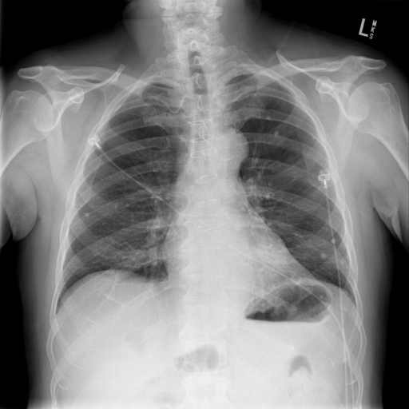
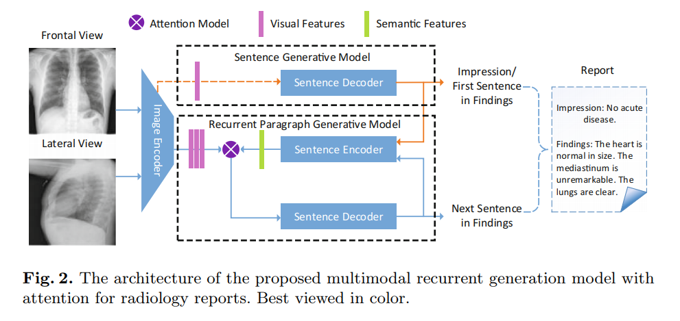

## Medical Report Generation
A base project for Medical Report Generation.

## Config
- python 2.7 / tensorflow 1.8.0
- extra package: nltk, json, PIL, numpy

## DataDownload
- IU X-Ray Dataset
    * The raw data is from [Open-i service of the National Library](https://openi.nlm.nih.gov/), it has many public datasets.
    * The proccessed data is on [Medical-Report/NLMCXR_png_pairs.zip](https://pan.baidu.com/s/1CwChGVu6HWFDN2Xsy_htTA)(提取码: vdb6), you should unzip it to dir 'data/NLMCXR_png_pairs/'.
- PreTrained InceptionV3 model
    * The raw model is from [TensorflowSlim Image Classification Model Library](https://github.com/tensorflow/models/tree/master/research/slim)
    * The proccessed data is on [Medical-Report/pretrain_model.zip](https://pan.baidu.com/s/1CwChGVu6HWFDN2Xsy_htTA)(提取码: vdb6), you shold unzip it to dir 'data/pretrain_model/'.

## Train
#### First, get post proccess data(I have done it)
- get 'data/data_entry.json', it is the report sentences.
- get 'data/train_split.json' and 'data/test_split.json', it is the ids for train/val/test.
- get 'data/vocabulary.json', it is the vocabulary extracted from report.

#### Second, get TFRecord files
- get 'data/train.tfrecord' and 'data/test.tfrecord'
    ```shell
    $ python datasets.py
    ```
    e.g. if you get tfrecord files, you must annotate the code for func 'get_train_tfrecord()'
#### Third, go train
- you can train directly.
    ```shell
    $ python train.py
    ```
- you can see the train process
    ```shell
    $ cd ./data
    $ tensorboard --logdir='summary'

## Demo
- You could use two chest x-ray imgs to test
    ```shell
    $ python demo.py --img_frontal_path='./data/experiments/CXR1900_IM-0584-1001.png' --img_lateral_path='./data/experiments/CXR1900_IM-0584-2001.png' --model_path='./data/model/my-test-2500'
    ```
- example

    
    
    ```shell
    $ The generate report:
         no acute cardiopulmonary abnormality
         the lungs are clear
         there is no focal consolidation
         there is no focal consolidation
         there is no pneumothorax or pneumothorax
    ```

## Framework
#### Core Framework


e.g.Yuan Xue et.al-**Multimodal Recurrent Model with Attention for Automated Radiology Report Generation**, MICCAI 2018

## Experments
#### Metrics Results
|  | BLEU_1 | BLEU_2 | BLEU_3 | BLEU_4 | METEOR | ROUGE | CIDEr |
| :---: | :---: | :---: | :---: | :---: | :---: | :---: | :---: |
| CNN-RNN<sup>[10]</sup> | 0.3087 | 0.2018 | 0.1400 | 0.0986 | 0.1528 | 0.3208 | 0.3068 |
| CNN-RNN-Att<sup>[11]</sup> | 0.3274 | 0.2155 | 0.11478 | 0.1036 | 0.1571 | 0.3184 | 0.3649 |
| Hier-RNN<sup>[9]</sup> | 0.3426 | 0.2318 | 0.1602 | 0.1121 | 0.1583 | 0.3343 | 0.2755|
| MRNA<sup>[6]</sup> | 0.3721 | 0.2445| 0.1729 | 0.1234 | 0.1647 | 0.3224 | 0.3054 |
| Ours | 0.4431 | 0.3116 | 0.2137 | 0.1473 | 0.2004 | 0.3611 | 0.4128 |

- CNN-RNN and CNN-RNN-Att are simple base models for image caption.
- Hier-RNN is a base model for image description generation, because we have not bounding boxes, so we use visual features 
from CNN directly to decode the sentence word by word.
- MRNA is a base model from the MICCAI 2018 paper<sup>[6]</sup>, we use visual features from CNN to generate first sentence, 
then we concat visual features and semantic features(last sentence encoded from 1d-conv layers) to generate second-final sentence
word by word.
- Ours are is based on MRNA, but we improve it.

e.g. I have only release code for hier rnn and MRNA because others are easy.

#### Details
I split train/test dataset as 2811/300, use Adam with initial learning rate is 1e-4 with 5 epoch for decay 0.9.Then I set 
generate max 8 sentence with max 50 words for a sentence. The word embedding size is 512 and RNN units is 512. The more details is on
config.py

#### IU X-Rat Datasets
The raw images are 7470, but both has frontal_view and lateral_view is 3391*2. The raw report is 3927, but sentence num >= 4 is 3631, 
because the report sentence num between 4 and 8 occupy 90% above, so I set max sentence num = 8. Both has image-pairs and report(sentence num >= 4) 
is 3111.

#### Result Between Normal and Abnormal Reports
When I analyse the reports from datasets, I have found **Normal Reports : Abnormal Reports = 2.5 : 1, unbalanced**.
My best result is(not release):

|  | BLEU_1 | BLEU_2 | BLEU_3 | BLEU_4 | METEOR | ROUGE | CIDEr |
| :---: | :---: | :---: | :---: | :---: | :---: | :---: | :---: |
| Total Test Data | 0.4431 | 0.3116 | 0.2137 | 0.1473 | 0.2004 | 0.3611 | 0.4128 |
| Normal Test Data | 0.5130 | 0.3628 | 0.2615 | 0.1750 | 0.2313 | 0.3894 | 0.4478 |
| Abnormal Test Data | 0.2984 | 0.1903 | 0.1274 | 0.0934 | 0.1289 | 0.2397 | 0.2641 |

e.g. Total means the total Test Dataset, Normal means the normal report(no disease) of Test Dataset, Abnormal 
means the abnormal report(with disease or abnormality).

## Summary
#### Process
Now, I have summarize the process of my research of Medical Report Generation.
- First, it is easy to contact this task with Image2Text Task, so I exploit the Image Captions methods to solve this task's problems, like CNN+RNN methods.
- Second, I found that Image Captions method can solve the one sentence(short), but this task has many sentences. So I use Image Paragraph Description Generation methods, like CNN+Hierarchical RNN.
- Next, I found the reports of this task has the Impression and Findings description, so I exploit QA + Hierarchical RNN method to solve this task's problems.
- Finally, I found that language informations are more important than image infos because small scale dataset, interesting.

#### Problems
There are many challenges for this task, I refer to some points of <sup>**[1]**</sup>.
- **Very Small Medical Data**, most medical datasets only with images and nearly without bounding boxes and reports, so it is very very overfit.
- **Very Uncertainty Report Descriptions**, because different doctors have different style description for diagnosis report.
- **More-Like Dense Caption Task not Story Generation**, we should ground the description sentence with relevant region.
- **Unsuitable Metrics**, the BLEU for machine translation and CIDEr for captioning and so on are not suitable for this task.
- **Impractical**, up to now, there are 4-5 papers <sup>**[5][6][7][8]**</sup>. public for this task, but to be honest, they are only for papers,
they do not release code.

#### Little Advice
- If you want to research medical report generation, you could get more data, and you could focus on the **Semantic Information** not **Visual Information** when data is small.
In VQA task, someones found that Language is more useful than Image.
- You could use more stronger Language Model(BERT, ELMo or Transformer), maybe useful.

## References
- [1][医学诊断报告生成论文综述](https://blog.csdn.net/wl1710582732/article/details/85345285)
- [2][Tensorflow Model released im2text](https://github.com/tensorflow/models/tree/master/research/im2txt)
- [3][MS COCO Caption Evaluation Tookit](https://github.com/tylin/coco-caption)
- [4]**TieNet Text-Image Embedding Network for Common Thorax Disease Classification and Reporting in Chest X-rays**, Xiaosong Wang et at, CVPR 2018, NIH
- [5]**On the Automatic Generation of Medical Imaging Reports**, Baoyu Jing et al, ACL 2018, CMU
- [6]**Multimodal Recurrent Model with Attention for Automated Radiology Report Generation**, Yuan Xue, MICCAI 2018, PSU
- [7]**Hybrid Retrieval-Generation Reinforced Agent for Medical Image Report Generation**, Christy Y. Li et al, NIPS 2018, CMU
- [8]**Knowledge-Driven Encode, Retrieve, Paraphrase for Medical Image Report Generation**, Christy Y. Li et al, AAAI 2019, DU
- [9]**A Hierarchical Approach for Generating Descriptive Image Paragraphs, Jonathan Krause** et al, CVPR 2017, Stanford
- [10]**Show and Tell: A Neural Image Caption Generator**, Oriol Vinyals et al, CVPR 2015, Google
- [11]**Show, Attend and Tell: Neural Image Caption Generation with Visual Attention**, Kelvin Xu et at, ICML 2015
